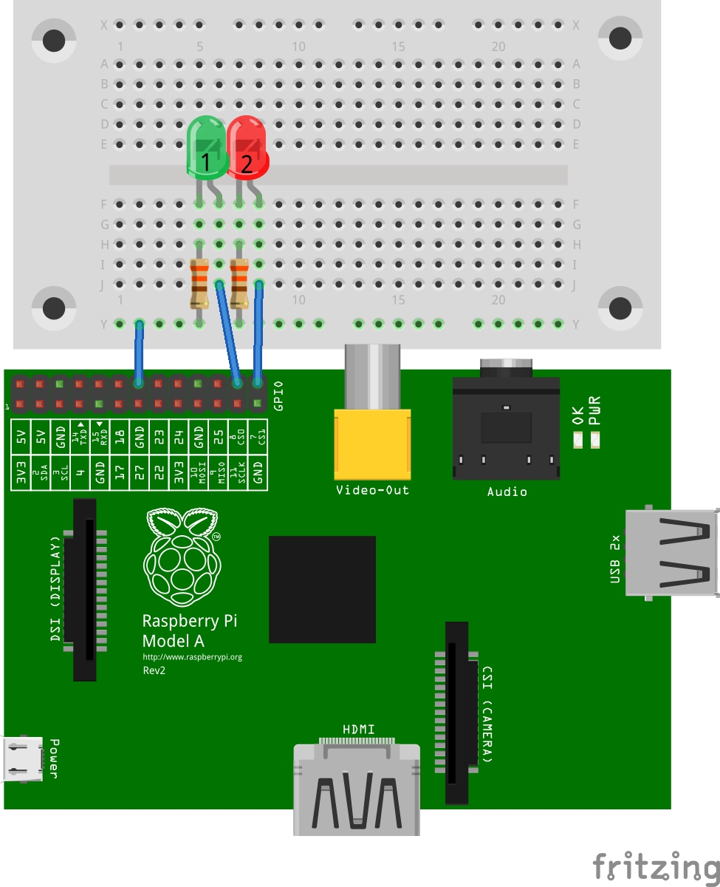
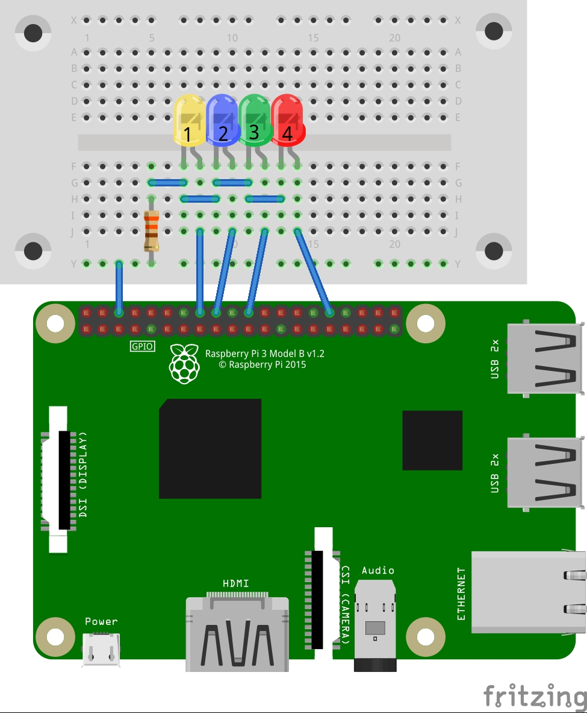
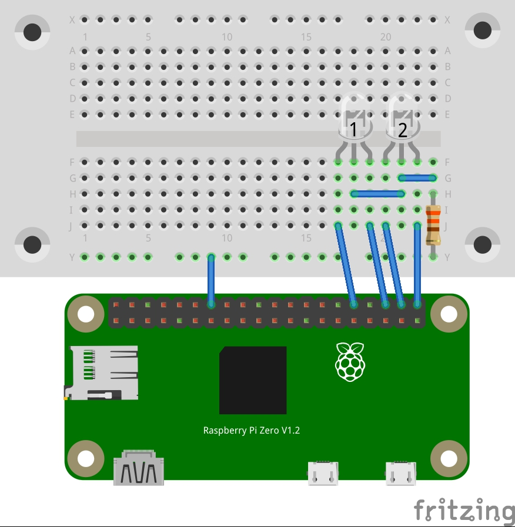

# __PiInfoLeds__

For the Raspberry Pi - make LEDs blink on network and/or SD card/USB storage device activity.

## __Contents__

* [PiDiskLeds](##PiDiskLeds)
* [PiNetLeds](##PiNetLeds)
* [Compiling](##Compiling)
  * [WiringPi](###WiringPi)
* [Usage](##Usage)
  * [PiDiskLeds](###PiDiskLeds)
  * [PiNetLeds](###PiNetLeds)
  * [Example Configuations](###Example-Configurations)
    * [Example 1: Two LEDs connected to the default GPIO pins](####example1)
    * [Example 2: Four LEDs](####example2)
    * [Example 3: Two LEDs (bi-color, 3-pin, common-cathode)](####example3)
  * [Running at Bootup](###Running-at-Bootup)
  * [Super-user](###Super-user)

## __PiDiskLeds__

__PiDiskLeds__ blinks one or two LEDs connected to one or two GPIO pins by a read or write access of any mounted block device (a.k.a. a "mass storage" or "disk drive" device). Not only on SD card access, but also on USB thumbdrive and hard drive activity. When two LEDs are used with this program, one can be assigned to indicate read access and the other write access.

## __PiNetLeds__

__PiNetLeds__ blinks one or two LEDs connected to one or two GPIO pins when there is receive or transmit activity on any network interface. Not only the built-in ethernet or WiFi interfaces, but also on any other USB ethernet or WiFi interface. When two LEDs are used with this program, one can be assigned to indicate receive activity and the other transmit activity  

## __Compiling__

Building the programs is easy:
~~~
make PiDiskLeds
make PiNetLeds
~~~
or
~~~
make all
~~~
To remove the binaries from the current directory, use:
~~~
make clean
~~~

### __WiringPi__

__PiNetLeds__ and __PiDiskLeds__ make use of Gordon Henderson's *WiringPi* library (wiringpi.com), so this needs to be installed in order to build the programs. Current versions of Raspbian come with *WiringPi* already installed.

## __Usage__

For both __PiDiskLeds__ and __PiNetLeds__, GPIO pins are selected using the *WiringPi* numbering scheme. The __gpio readall__ command can be used to view the mapping of *WiringPi* pin numbers to physical pin locations on the specific Raspberry Pi model being used.

The *-\?*, *--help*, or *--usage* option may be used with either program to view all available options. The *-V* option wil display the program's version number.

### __PiDiskLeds__

~~~
PiDiskLeds [options]
~~~
Option|Action
--- | ---
-d, --detach|Detach from terminal (run as a background process [a.k.a daemon]).
-p, --poll interval=MILLISECONDS|Sets the time interval (in milliseconds) between checks for new disk activity.
-r, --read led=PIN|Set the GPIO pin number connected to the LED indicating disk read activity.
-w, --write led=PIN|Set the GPIO pin number connected to the LED indicating disk write activity.
__NOTE:__ By default, __PiDiskLeds__ uses *WiringPi* pin 10 by for both read and write activity indication. This pin is also used for the __CE0__ signal in the default configuration of the Pi's __SPI0__ interface. If an add-on utilizing SPI communications is connected, it is likely that another, unused, pin will need to be selected using the *-r* or *-w* option.

### __PiNetLeds__

~~~
PiNetLeds [options]
~~~
Option|Action
--- | ---
-d, --detach|Detach from terminal (run as a background process [a.k.a daemon]).
-p, --poll interval=MILLISECONDS|Sets the time interval (in milliseconds) between checks for new network activity.
-r, --receive led=PIN|Set the GPIO pin number connected to the LED indicating network reveive activity.
-t, --transmit led=PIN|Set the GPIO pin number connected to the LED indicating network transmit activity.
__NOTE:__ By default, __PiNetLeds__ uses *WiringPi* pin 11 by for both read and write activity indication. This pin is also used for the __CE1__ signal in the default configuration of the Pi's __SPI0__ interface. If an add-on utilizing SPI communications is connected, it is possible that another, unused, pin will need to be selected using the *-r* or *-t* option.

### __Example Configurations__

#### <a name="example1"/>_Example 1: Two LEDs connected to the default GPIO pins_

LED|Blinks to indicate
--- | ---
1 (green)|_all_ block device (mass storage) read or write activity
2 (red)|_all_ network interface (ethernet or WiFi) receive or transmit activity

Commands:
~~~
PiDiskLeds --detach
PiNetLeds
~~~

---

#### <a name="example2"/>_Example 2: Four LEDs_

LED|Blinks to indicate
--- | -----------------------------------------------------------
1 (yellow)|network interface (ethernet or WiFi) transmit activity
2 (blue)|network interface (ethernet or WiFi) receive activity
3 (green)|block device (mass storage) read activity
4 (red)|block device (mass storage) write activity

Commands:
~~~
PiDiskLeds --read led=6 --write led=26
PiNetLeds --receive led=5 --transmit led=4
~~~

---

#### <a name="example3"/>_Example 3: Two LEDs (bi-color, 3-pin, common-cathode)_

LED|Blinks to indicate
--- | -----------------------------------------------------------
1 (red-green)|red=network interface (ethernet or WiFi) transmit activity, green=network interface (ethernet or WiFi) receive activity
2 (red-blue)|blue=block device (mass storage) read activity, red=block device (mass storage) write activity

Commands:
~~~
PiDiskLeds --poll interval=50 -w25 -r 24 -d
PiNetLeds -r 22 -d -t 23 -p10
~~~

---

### __Running at Bootup__

Configuration files have been provided in the *./intscripts* directory to allow both programs to be started at system boot, before any user login. If the programs are to be started during system bootup, it is recommended to copy the binaries to the __*/usr/local/bin*__ directory, since the configuration files assume that they reside there. View the __*README*__ file in the __*./initscripts*__ directory for specific instructions to enable running the programs upon system boot.

### __Super-user__

__PiNetLeds__ and __PiDiskLeds__ need *super-user* privileges, so when running the programs after system boot you may need to invoke them with "sudo", e.g.:
~~~
sudo PiNetLeds -d -p 10 -r 28 -t 29
~~~
